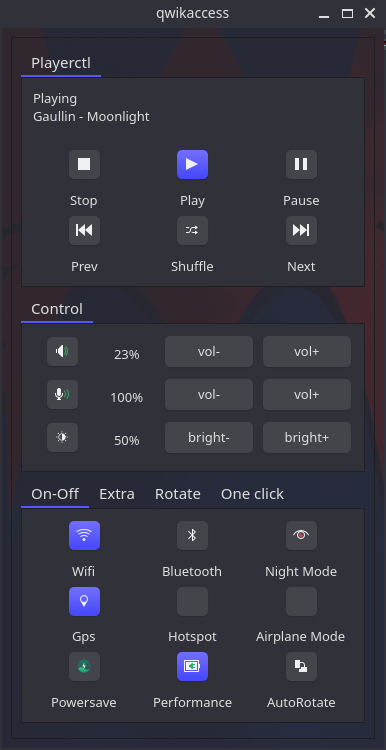

# qwikaccess
A point and click Qt GUI for script that we use frequently.



### Dependancies
* qt5-base

### Optinal Dependancies for qwikaccess
* ffmpeg - for screenshot & audio,screen,screencam recording.
* v4l-utils - for camera.
* libpulse - for audio/mic - mute/unmute - vol+/-.
* brightnessctl - for brightness up and down .
* xorg-xrandr - for screen rotation.
* xorg-xinput - for autorotation.
* inotify-tools - for autorotation.
* iio-sensor-proxy - for autorotation.
* redshift - for night mode.
* bluez-tools  - for bluetooth.
* networkmanager or connman - for wifi and hotspot.
* rfkill (util-linux) for airplane mode.
* xdg-utils for lock screen (xdg-screensaver lock).
* systemd - for leave commands and gps services. 
* grep - used in scripts.

## Installation
```
git clone https://github.com/librewish/qwikaccess
cd qwikaccess
qmake && make
make install
```

for archlinux and archlinux based distributions.
install from aur.

https://aur.archlinux.org/packages/qwikaccess-git/

```
yay -S qwikaccess-git
```


## License

Copyright (C) 2020 Shrinivas kumbhar (librewish) librewish@gmail.com

This program is free software: you can redistribute it and/or modify it under the terms of the GNU General Public License as published by the Free Software Foundation, either version 3 of the License.

This program is distributed in the hope that it will be useful, but WITHOUT ANY WARRANTY; without even the implied warranty of MERCHANTABILITY or FITNESS FOR A PARTICULAR PURPOSE. See the GNU General Public License for more details.
